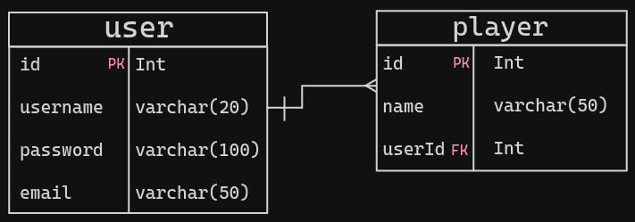

### Escolha sua lingua / Choose your language.
- [🇧🇷](#🇧🇷)
- [🇺🇸](#🇺🇸)

# 🇧🇷
# Random Team Picker API

Bem-vindo à documentação da API do Random Team Picker! Esta API é responsável por gerenciar os jogadores.

### Estrutura
A aplicação tem uma estrutura de um banco relacional, mais especificamente MySQL. A estrutura é essa:


### Configuração da API
A API utiliza um banco de dados para armazenar os jogadores e o Prisma como ORM. Certifique-se de configurar as informações do Prisma entre outras coisas no arquivo `.env`.

Exemplo do arquivo `.env`:
```bash
DATABASE_URL="mysql://root:pass@db:3306/random-team-picker-db"
SALT_ROUNDS=11
JWT_SECRET=SECRET
```
> Já existe um arquivo chamado `.env.example`, basta renomeá-lo para apenas `.env`

### Instale as dependências
Utilize do comando abaixo para instalar as dependências da API:
```bash
npm install
```

## Endpoints
⚠️ Em construção... ⚠️

# 🇺🇸
# Random Team Picker API

Welcome to the Random Team Picker API documentation! This API is responsible for managing players.

### Structure
The application has the structure of a relational database, more specifically MySQL. The structure is this:


### API Configuration
The API uses a database to store players and Prisma as the ORM. Make sure to configure Prisma information among other things in the `.env` file.

Example of the `.env` file:
```bash
DATABASE_URL="mysql://root:pass@db:3306/random-team-picker-db"
SALT_ROUNDS=11
JWT_SECRET=SECRET
```
> There is already a file called `.env.example`, just rename it to just `.env`

### Install dependencies
Use the command below to install the API dependencies:
```bash
npm install
```

## Endpoints
⚠️ Under construction... ⚠️